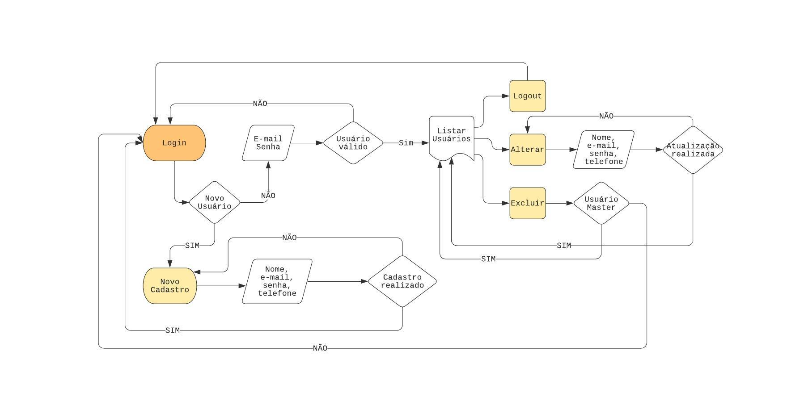

# projeto-pitang

A solução implementada permite a inclusão de usuários com seus respectivos números de telefones. Possui um cadastro para novos usuários e opção de login, redirecionando o usuário para tela de listagem, onde poderá detalhar os números de telefones, alterar e remover o cadastro. Implementa também controle de acesso, onde temos um usuário master (admin@admin.com) que pode visualizar as informações de todos os usuários cadastrados no sistema.

O usuário possui a seguinte estrutura: 
-	Nome
-	E-mail
-	Senha
-	Lista de Telefones
    *	DDD
    *	Numero
    *	Tipo (Celular, Residencial, Comercial)

### Dos requisitos obrigatórios a aplicação possui:
- Estruturação em camadas; 
- Uso de banco de dados relacional MySql; 
- Processo de build utilizando Maven;
- Persistência utilizando JDBC; 
- Java 13; 
- Utilização de Servlet e JSP;
- jQuery; 
- Disponibilização do código no repositório Github;

### Dos requisitos desejáveis a aplicação possui:
- Disponibilização da aplicação no serviço de hospedagem online da Heroku (https://desafio-java-web.herokuapp.com/);
- Testes unitários com jUnit. 

### Pontos que podem ser melhorados:
- Identificar se houve alteração nos telefones e qual telefone foi alterado (atualmente é feita a exclusão de todos os telefones e uma nova inserção de todos os telefones);
- O mecanismo de inserção de telefone, tanto no novo cadastro, quanto na alteração, uma vez que o sistema só identifica que um telefone foi inserido quando o usuário clica no botão de ‘+’. 

**Fluxograma do projeto**

**Fluxo de telas**

